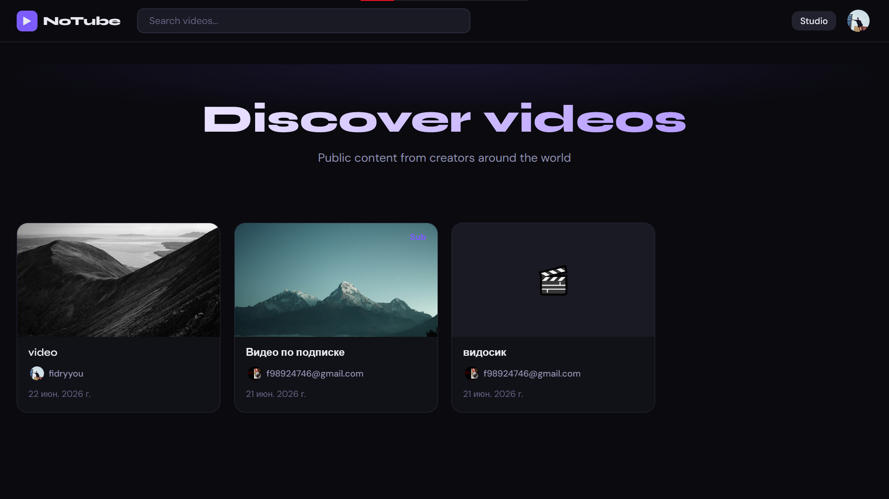
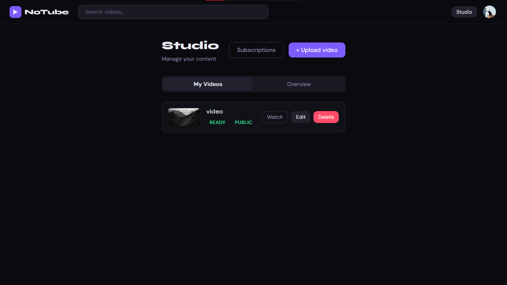
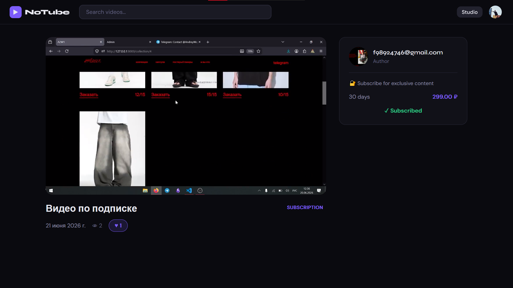

# no-tube

Микросервисная видеохостинг-платформа: загрузка видео, асинхронная транскодизация в DASH, подписки на авторов с платным доступом (YooKassa), OAuth-авторизация через Google и Яндекс. Бэкенд построен на FastAPI, тяжёлая обработка видео вынесена в отдельный сервис на Go.

> pet-проект, демонстрирующий микросервисную архитектуру: разделение API и видео-обработки, очереди сообщений, кэш, S3-хранилище и фоновые задачи.

## Видео-демо

https://github.com/user-attachments/assets/20cdfab4-2ed0-47ab-8655-9d146e7b0afe

## Содержание

- [Архитектура](#архитектура)
- [Стек технологий](#стек-технологий)
- [Возможности](#возможности)
- [Скриншоты и демо](#скриншоты-и-демо)
- [Запуск проекта](#запуск-проекта)
- [Переменные окружения](#переменные-окружения)
- [Структура репозитория](#структура-репозитория)
- [API](#api)

## Архитектура

```
                      ┌───────────────┐
                      │   Frontend    │  React + Vite + dash.js
                      │   (no-tube)   │
                      └───────┬───────┘
                              │ REST (axios)
                              ▼
                      ┌───────────────┐        ┌──────────────┐
                      │   FastAPI     │◄──────►│  PostgreSQL  │
                      │   API (api)   │        └──────────────┘
                      └───┬───────┬───┘
                          │       │
                 session  │       │ pub/sub задач
                 кэш      ▼       ▼
                ┌──────────┐   ┌───────────┐
                │  Redis   │   │ RabbitMQ  │
                └──────────┘   └─────┬─────┘
                                     │
                         ┌───────────┴────────────┐
                         ▼                        ▼
               ┌──────────────────┐      ┌──────────────────┐
               │ taskiq_worker /  │      │  video_worker    │
               │ taskiq_scheduler │      │  (Go + ffmpeg)   │
               │ почта, очистка   │      │транскодинг в DASH│
               └──────────────────┘      └─────────┬────────┘
                                                   ▼
                                            ┌──────────────┐
                                            │   S3 storage │
                                            │ (private/    │
                                            │  public)     │
                                            └──────────────┘
```

Загруженное видео сначала попадает в приватный бакет S3. После запроса на обработку API публикует сообщение в RabbitMQ — это подхватывает воркер на Go, который скачивает оригинал, прогоняет через ffmpeg в формат DASH (несколько битрейтов) и заливает фрагменты обратно в S3 (приватный или публичный бакет — в зависимости от видимости видео). Параллельно может грузиться сразу несколько видео, реализован пул воркеров для обработки видео. Статус обработки видео обновляется напрямую в PostgreSQL воркером на Go, а пользователь опрашивает статус через API.

Платный доступ к видео реализован через подписки на авторов: пользователь оплачивает подписку через YooKassa (виджет оплаты, эмбеддед-токен), после успешного платежа баланс/доступ обновляется через вебхук.

## Стек технологий

**Backend (Python)**
- FastAPI, Pydantic v2, Pydantic Settings
- SQLAlchemy 2.0 (async) + asyncpg, Alembic — миграции
- Redis — кэш
- RabbitMQ (aio-pika) — очередь задач на обработку видео
- Taskiq (broker на RabbitMQ) — фоновые задачи и шедулер (email, отложенное удаление пользователей)
- aiobotocore — асинхронный клиент S3 (presigned URLs)
- YooKassa REST API — приём платежей
- OAuth2 — Google и Яндекс
- pytest, pytest-asyncio — тесты

**Video processing (Go)**
- ffmpeg — транскодинг в MPEG-DASH с несколькими уровнями битрейта
- RabbitMQ consumer — получение задач на обработку
- AWS S3 SDK v2 (transfer manager) — скачивание/загрузка файлов
- database/sql + lib/pq — обновление статуса обработки в PostgreSQL
- Отдельный `api_proxy` сервис — раздача приватного видеоконтента

**Frontend**
- React 18 + Vite
- React Router, Zustand — стейт-менеджмент
- dash.js — плеер для MPEG-DASH
- axios

**Инфраструктура**
- Docker Compose: api, postgres, redis, rabbitmq, taskiq_worker, taskiq_scheduler, video_worker, api_proxy, frontend

## Возможности

- Регистрация/логин по email и паролю, подтверждение почты
- OAuth-вход через Google и Яндекс
- Загрузка видео напрямую в S3 через presigned URL
- Асинхронная обработка видео в DASH с несколькими качествами с возможностью параллельно обрабатывать несколько видео


- Публичные, приватные и подписочные (SUBSCRIPTION) видео
- Лайки, история просмотров, счётчик просмотров/лайков
- Платные подписки на авторов через YooKassa
- Загрузка аватара и превью видео через presigned URL
- Личный кабинет автора (Studio) — управление своими видео

## Скриншоты и демо

### Главная страница


### Студия автора


### Просмотр видео и плеер


## Запуск проекта

### Требования

- Docker и Docker Compose
- Аккаунт S3-совместимого хранилища (например, AWS S3 или Yandex Object Storage)
- Учётные данные YooKassa (для тестового режима подойдут тестовые shopId/secretKey)
- OAuth-клиенты Google и Яндекс (для входа через соцсети)

### Шаги

1. Клонировать репозиторий:
   ```bash
   git clone https://github.com/<your-username>/no-tube.git
   cd no-tube
   ```

2. Создать файл окружения `backend/.env.prod` (или `.env.dev`, в зависимости от `MODE` в `app/core/config.py`) на основе раздела [Переменные окружения](#переменные-окружения).

3. Создать `.env` в корне проекта со значениями для `docker-compose.yml` (`DB_USER`, `DB_PASS`, `DB_NAME`, `REDIS_PASS`, `RABBITMQ_USER`, `RABBITMQ_PASS`).

4. Заполнить конфиг для видео-воркера: `video-processing-worker/config/prod.docker.yaml`.

5. Запустить всё через Docker Compose:
   ```bash
   docker compose up --build
   ```

6. После старта:
   - API: http://localhost:8000
   - Frontend: http://localhost:5173
   - RabbitMQ management UI: http://localhost:15672
   - Video proxy: http://localhost:8001

## Переменные окружения

Бэкенд читает настройки через Pydantic Settings (`backend/app/core/config.py`). Ключевые переменные:

| Группа | Переменные |
|---|---|
| База данных | `DB_HOST`, `DB_PORT`, `DB_NAME`, `DB_USER`, `DB_PASS` |
| RabbitMQ | `RABBITMQ_HOST`, `RABBITMQ_PORT`, `RABBITMQ_USER`, `RABBITMQ_PASS` |
| Redis | `REDIS_HOST`, `REDIS_PORT`, `REDIS_PASS` |
| SMTP | `SMTP_HOST`, `SMTP_PORT`, `SMTP_USER`, `SMTP_PASS` |
| OAuth | `GOOGLE_CLIENT_ID`, `GOOGLE_CLIENT_SECRET`, `YANDEX_CLIENT_ID`, `YANDEX_CLIENT_SECRET` |
| S3 | `AWS_ACCESS_KEY_ID`, `AWS_SECRET_ACCESS_KEY`, `ENDPOINT_URL`, `REGION_NAME`, `PRIVATE_BUCKET`, `PUBLIC_BUCKET`, `VIDEO_PROCESSIG_PREFIX`, `PUBLIC_VIDEO_BASE_URL`, `PUBLIC_VIDEO_PREFIX` |
| Платежи | `SECRET_NOTIFICATION`, `SECRET_KEY_YOUKASSA`, `SHOP_ID` |
| Видео-проксирование | `PRIVATE_VIDEO_PROXY_URL`, `PRIVATE_VIDEO_PROXY_ENDPOINT` |
| Логирование | `LOG_LEVEL` |

## Структура репозитория

```
no-tube/
├── backend/                     # FastAPI приложение
│   ├── app/
│   │   ├── api/                 # роутеры, зависимости, обработчики исключений
│   │   ├── core/                # конфиг, логгер
│   │   ├── db/                  # модели SQLAlchemy, сессия
│   │   ├── domain/               # доменные сущности и enum'ы
│   │   ├── infrastructure/      # Redis, RabbitMQ, S3 клиенты
│   │   ├── repositories/        # репозитории + Unit of Work
│   │   ├── schemas/              # Pydantic-схемы запросов/ответов
│   │   ├── services/             # бизнес-логика (user, video, payment)
│   │   ├── tasks/                # taskiq broker/scheduler/задачи
│   │   └── utils/                 # хэширование, email, OAuth-хелперы
│   └── tests/
├── frontend/no-tube/             # React-приложение
│   └── src/
│       ├── api/                  # axios-клиент
│       ├── components/           # UI, видео-компоненты, layout
│       ├── pages/                # HomePage, WatchPage, StudioPage, ProfilePage и др.
│       └── store/                 # zustand-стор авторизации
├── video-processing-worker/      # сервис на Go: транскодинг видео
│   ├── cmd/api/                  # api_proxy — раздача приватных видео
│   ├── cmd/worker/                # video_worker — обработчик очереди
│   └── internal/                  # ffmpeg, s3, consumer, storage, config
└── docker-compose.yml
```

## API

Полная интерактивная документация (Swagger UI) доступна после запуска по адресу:

```
http://localhost:8000/docs
```

Основные группы эндпоинтов:

- `POST /api/v1/user/register`, `/login`, `/quit`, `/confirm` — аутентификация по email
- `GET /api/v1/user/google/url`, `POST /api/v1/user/google/callback` — OAuth Google
- `GET /api/v1/user/yandex/query_params`, `POST /api/v1/user/yandex/callback` — OAuth Яндекс
- `GET /api/v1/user/me`, `PATCH /api/v1/user/me/avatar`, `PATCH /api/v1/user/change_password`
- `POST /api/v1/videos/`, `GET /api/v1/videos/`, `GET/PATCH/DELETE /api/v1/videos/{id}`
- `POST /api/v1/videos/{id}/upload-url`, `POST /api/v1/videos/{id}/process` — загрузка и запуск обработки
- `GET /api/v1/videos/{id}/dash` — DASH-манифест
- `POST/DELETE /api/v1/videos/{id}/likes`, `POST /api/v1/videos/{id}/watch`
- `POST /api/v1/videos/subscriptions/authors/`, `GET .../{author_id}`, `POST .../{sub_id}/payment` — подписки и оплата
- `POST /api/v1/payment/confirmation_token`, `POST /api/v1/payment/balance` — интеграция с YooKassa
